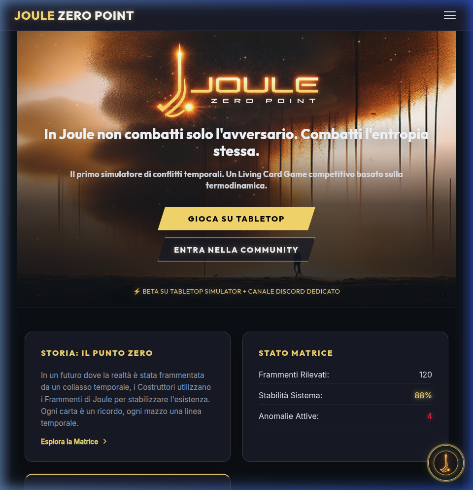
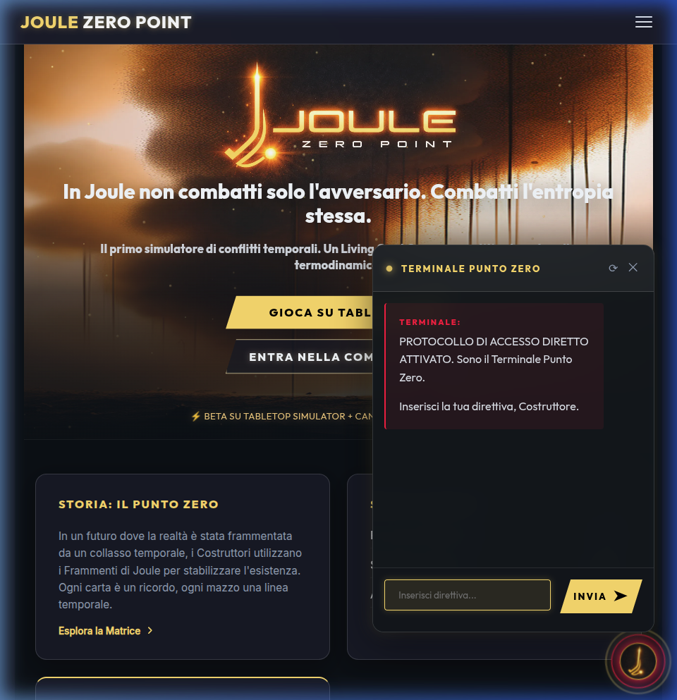
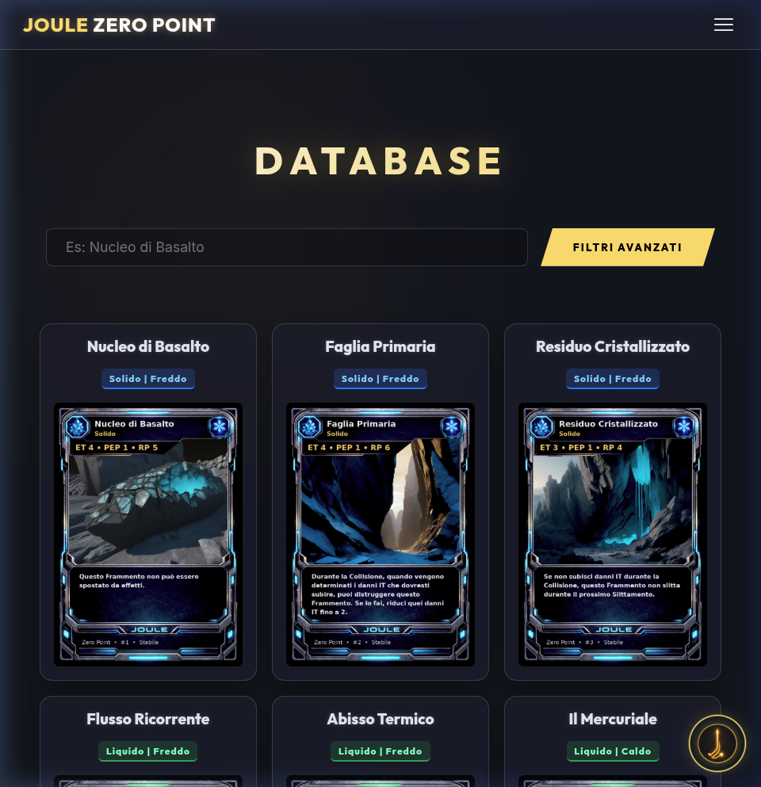
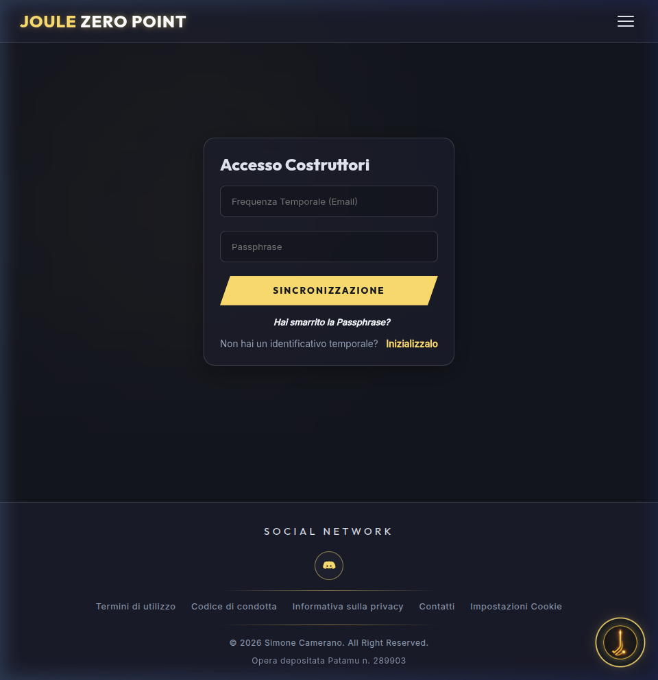

<p align="center">
  
</p>

<h1 align="center">JOULE: ZERO POINT</h1>

<p align="center">
  <strong>"In the Zero Point, time is a weapon. Master the energy, shape reality."</strong><br />
  <em>A Cyberpunk Strategic Card Game with Advanced LLM Integration.</em>
</p>

<p align="center">
  <a href="https://www.joulezeropoint.com/">
    
  </a>
  <a href="https://discord.gg/csXJz6zB">
    
  </a>
  <a href="https://steamcommunity.com/sharedfiles/filedetails/?id=3673801132">
    
  </a>
  
</p>

<p align="center">
  
  
  
  
  
  
  
  
</p>

---

## 🌌 Overview

**Joule: Zero Point** is more than a card game — it's an immersive cyberpunk experience where the laws of physics have collapsed. Each player takes on the role of a **Constructor**, manipulating the flow of time across three distinct zones: **Past, Present, and Future**.

The beating heart of the project is the **Zero Point Terminal**, an AI-powered neural interface that assists players with lore retrieval, card statistics, and real-time rule arbitration — all while staying fully in-character.

---

## 📘 Technical Documentation

For a comprehensive analysis of the system's architecture, security protocols, and engineering decisions, I have prepared a dedicated document:

👉 **[Technical Deep Dive (docs/TECHNICAL_DEEP_DIVE.md)](./docs/TECHNICAL_DEEP_DIVE.md)**

*Includes details on: SSoT with Google Sheets, AI Scudo Temporale (Safety Audit), NoSQL Sanitization, and PWA Caching Strategy.*

---

## 🖼️ Screenshots

### 🏠 Home — The Zero Point Atmosphere


### 🖥️ Zero Point Terminal — AI Neural Interface


### 🎴 Fragment Database — Card Discovery


### 🛠️ Deckbuilder — Tactical Workshop


---

## ✨ Key Features

| Feature | Description |
|---|---|
| 🖥️ **Zero Point Terminal** | LLM-driven AI referee that responds in-character to player queries |
| 🎴 **Fragment Database** | Full card library with advanced type/stat filters |
| 🛠️ **Deckbuilder** | Create, save, and share tactical decks with Constructor hero |
| 📜 **Rulebook & Lore** | Integrated Rulebook 5.0 and News/Lore communication hub |
| 🔐 **Identity System** | JWT auth, email verification, alias management, password recovery |
| 📤 **Deck Export** | Client-side generation of PDFs and TTS kits (no backend dependency) |

---

## 🚀 Quick Start with Docker (Recommended)

The entire ecosystem (Frontend, Backend, and local MongoDB) is orchestrated via Docker Compose for an instant setup.

```bash
git clone https://github.com/Galdrial/JouleZeroPointWeb.git
cd JouleZeroPointWeb
docker compose up --build
```
> [!TIP]
> The frontend will be available at `http://localhost:5174`. The backend will use your `.env` configuration.

### 🧪 Database Seeding (Mandatory)
After the containers are up, you **must** populate the database with the card fragments:
```bash
docker exec -it joule-backend node scripts/seedCards.js
```

---

## 🛠️ Manual Installation (Non-Docker)

If you prefer to run the ecosystem without Docker, ensure you have **Node.js (v20+)** and **MongoDB** installed.

### 1. Backend Setup
```bash
cd backend
npm install --legacy-peer-deps
cp .env.example .env  # Configure your MONGODB_URI
npm run build         # Required for seeding
node scripts/seedCards.js
npm run dev
```

### 2. Frontend Setup
```bash
cd frontend
npm install --legacy-peer-deps
cp .env.example .env  # Ensure VITE_API_URL=http://localhost:3000/api/v1
npm run dev
```

---

## 🧪 Tech Stack

### Frontend
- **Framework:** Vue 3 (Composition API) + TypeScript
- **Build Engine:** Vite
- **State Management:** Pinia
- **Styling:** Vanilla CSS — custom cyberpunk design system
- **Synthesis Engine:** jsPDF (PDF) & JSZip (TTS)

### Backend
- **Runtime:** Node.js & Express
- **Database:** MongoDB Atlas (Mongoose ODM)
- **AI Engine:** OpenAI SDK (Neural Terminal)
- **Security:** Helmet, Rate Limiter, CORS, NoSQL Injection Sanitizer
- **Infrastructure:** Docker & Docker Compose

---

## 🔐 Environment Variables

Copy `backend/.env.example` to `backend/.env` and fill in the required values:

| Variable | Description |
|---|---|
| `JWT_SECRET` | Secret key for signing JWTs |
| `MONGODB_URI` | MongoDB Atlas connection string |
| `OPENAI_API_KEY` | OpenAI API key for the AI Terminal |
| `SMTP_HOST / USER / PASS` | SMTP credentials for transactional email |

---

## 🚢 Deployment

| Layer | Platform |
|---|---|
| Frontend | Vercel (Production) |
| Backend | DigitalOcean / Private VPS |
| Database | MongoDB Atlas |

---

## 👤 Author & Legal

**Simone Camerano** — Design, Mechanics & Lead Development

> Joule: Zero Point is registered on the **Patamu Registry** (deposit #284864).
> © 2026 Simone Camerano. All Rights Reserved. Proprietary software.

---

<p align="center">
  <em>"Chaos is a weapon. Use it."</em>
</p>
